# 🤖 AIPlanetProject
*Note:* This repo is cloned from `argoproj/rollouts-demo` and modified by `Uj5ghare/AIPlanetProject`
<br>
*Task:* Dockerizing a simple web application, deploy it to a Kubernetes cluster using Argo CD, and manage its release process with Argo Rollouts.
*Explanation Video:* https://drive.google.com/file/d/1SA6qr2qri1lv0olQNljqHeG2zh7Q7t2q/view?usp=sharing


<br>


### 🈸 Software Requirements

- Kubernetes cluster (Minikube, kind, or a cloud provider's Kubernetes service)
- Docker
- Kubectl
- Git version control
- Argo CD installed on the Kubernetes cluster
- Argo Rollouts Controller installed on the Kubernetes cluster
- Argo Rollouts Plugin installed on the kubernetes cluster

### 📔 Knowledge Requirements

- Basic understanding of Kubernetes concepts (Pods, Deployments, Services)
- Familiarity with Docker and containerization
- Experience with Git for version control
- Basic understanding of GitOps practices
- Familiarity with Argo CD and Argo Rollouts documentation

##
## 🚀 Step-by-Step Guide to GitOps with Argo CD and Argo Rollouts

### Task 1: Setup and Configuration

**Create Git repo and Install prerequsites**

1. Create a new repository on GitHub (or another Git hosting platform).
 
2. Clone that repo on (VScode,EC2,CMD):
```
git clone https://github.com/Uj5Ghare/AIPlanetProject.git
```

3. Run this shell script to install all the prerequisites(Check: 2GB RAM, 2vCPU, 10GB+ Storage)
```
sudo ./prerequisites.sh
```

##

**Check all prerequisites**

1. Check if Docker is install and running:

```
docker --version
systemctl status docker
```

2. Check if minikube is installed
```
minikube version
minikube start --driver=docker
```

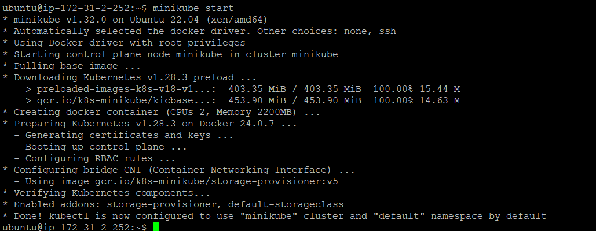


3. Check if ArgoCD,Rollout & Rollout Plugin is running:

```
kubectl get pods -n argocd
kubectl get pods -n argo-rollouts
kubectl argo rollouts version
```
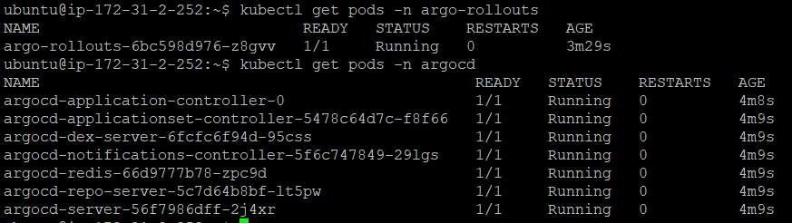


##
### Task 2: Creating the GitOps Pipeline

**Dockerize the Application:**

1. Create a Dockerfile to build your web application image, e.g.:

```
# Use the official Golang image from the Docker Hub as the base image
FROM golang:1.16 as build

# Set the working directory inside the container
WORKDIR /go/src/app

# Copy everything from the current directory to the working directory inside the container
COPY . .

# Run the 'make' command to build the application
RUN make

# Start a new stage from scratch
FROM scratch

# Copy all HTML, PNG, JS, ICO, and CSS files from the current directory to the root directory inside the container
COPY *.html ./
COPY *.png ./
COPY *.js ./
COPY *.ico ./
COPY *.css ./

# Copy the 'rollouts-demo' binary from the 'build' stage to the root directory inside the container
COPY --from=build /go/src/app/rollouts-demo /rollouts-demo

# Declare and set the 'COLOR' environment variable
ARG COLOR
ENV COLOR=${COLOR}

# Declare and set the 'ERROR_RATE' environment variable
ARG ERROR_RATE
ENV ERROR_RATE=${ERROR_RATE}

# Declare and set the 'LATENCY' environment variable
ARG LATENCY
ENV LATENCY=${LATENCY}

# Specify the command to run when the container starts
ENTRYPOINT [ "/rollouts-demo" ]
```

2. To add following secretes follow this path (go to your repo -> settings -> secrets and variables -> Actions -> new repository secrets -> add following scretes one by one)

```
DOCKER_HUB_USERNAME=<your-dockerhub-username>
DOCKER_HUB_ACCESS_TOKEN=<your-dockerhub-token>
COLOR=<blue,red,purple,yellow>
```

3. Create github workflow to automate the process of Docker image building and pushing into DockerHub in this path(.github/workflows/docker-image.yml)
```
name: AIPlanet-Project # This is the name of your workflow

on:
  push:
    branches: [main] # This workflow gets triggered when there's a push event on the 'main' branch

jobs:
  push-image:
    runs-on: ubuntu-latest # The type of runner that the job will run on

    steps:
      - uses: actions/checkout@v2 # This step checks-out your repository under $GITHUB_WORKSPACE

      - name: Login to DockerHub
        uses: docker/login-action@v1 # This step logs in to DockerHub
        with:
          username: ${{ secrets.DOCKER_HUB_USERNAME }} # DockerHub username stored as a GitHub secret
          password: ${{ secrets.DOCKER_HUB_ACCESS_TOKEN }} # DockerHub access token stored as a GitHub secret

      - name: Build the Docker image
        run: docker build --build-arg COLOR=${{ secrets.COLOR }}  -t ${{ secrets.DOCKER_HUB_USERNAME }}/rollouts-demo:${{ secrets.COLOR }} . # This step builds the Docker image using the 'COLOR' build argument

      - name: Push the Docker image
        run: docker push ${{ secrets.DOCKER_HUB_USERNAME }}/rollouts-demo:${{ secrets.COLOR }} # This step pushes the Docker image to DockerHub

  update-manifest:
    needs: push-image # This job depends on the 'push-image' job. It will not start until 'push-image' has completed successfully.
    runs-on: ubuntu-latest # This job runs on an Ubuntu-latest runner.

    steps:
      - name: Checkout code
        uses: actions/checkout@v2 # This step checks out a copy of your repository.

      - name: Update Kubernetes manifests # This step updates the Docker image tag in your Kubernetes manifest file (rollout.yml) with the value of the COLOR secret.
        run: |
          sed -i "s|uj5ghare/rollouts-demo:.*|uj5ghare/rollouts-demo:${{ secrets.COLOR }}|" rollout.yml

      - name: Commit and push changes # This step configures your git user name and email, commits the changes made in the previous step with a message, and then pushes the commit to your repository.
        run: |
          git config --global user.name 'Uj5Ghare'
          git config --global user.email 'ujwal5ghare@gmail.com'
          git commit -am "Update Docker image tag to ${{ secrets.COLOR }}"
          git push
```

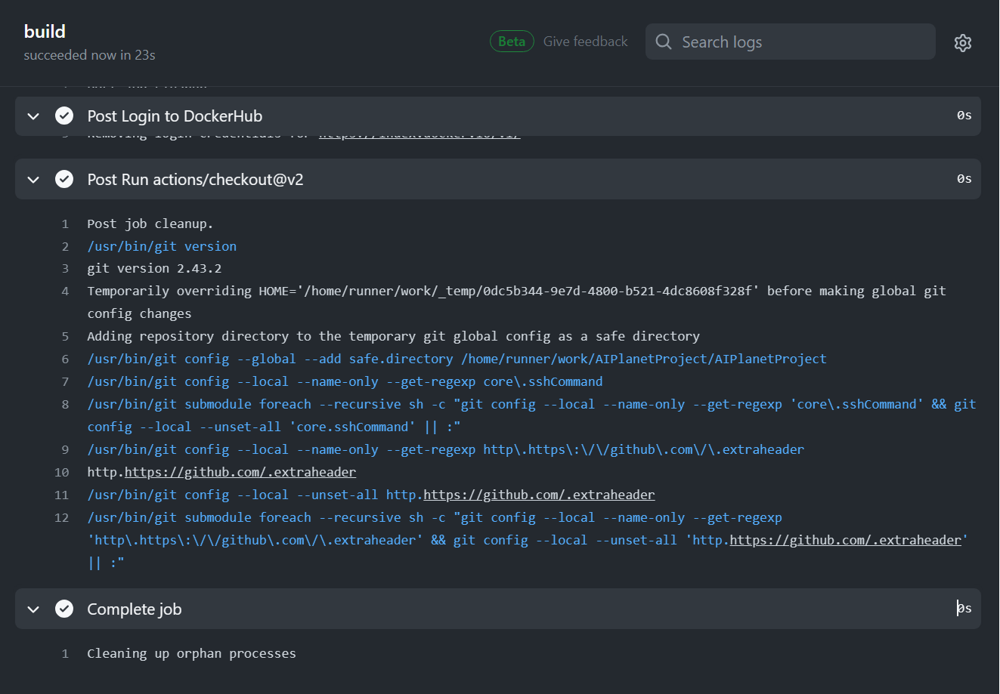
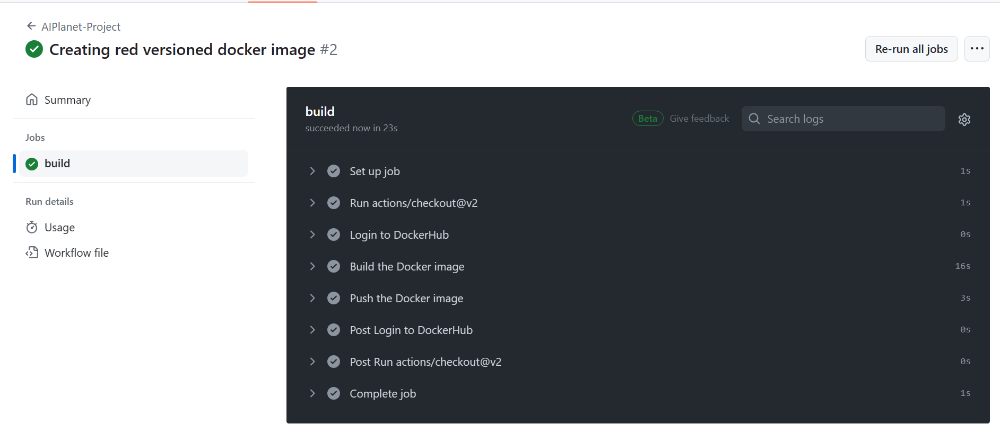

##
**Deploy the Application Using Argo CD Rollouts:**

1. Create a Kubernetes application manifest in your repository `rollout.yml`:

```
# The API version for Argo Rollouts
apiVersion: argoproj.io/v1alpha1

# The kind of the Kubernetes resource
kind: Rollout

# Metadata about the rollout
metadata:
  # The name of the rollout
  name: ai-ro
  # The namespace in which the Rollout will be created
  namespace: ai-ns

# Specification for the rollout
spec:
  # The number of desired pods for the rollout. This is the number of instances of your application that should be running.
  replicas: 4

  # Label selector for pods. Existing ReplicaSets whose pods are selected by this will be the ones affected by this rollout.
  # It's how the Rollout knows which pods to manage.
  selector:
    matchLabels:
      app: ai-app

  # Template describes the pods that will be created. This is where you define the containers, volumes, etc. that make up your application.
  template:
    metadata:
      labels:
        app: ai-app
    spec:
      containers:
      - name: ai-bluecon
        # The Docker image for the container
        image: uj5ghare/rollouts-demo:blue
        ports:
        # The port that the container exposes
        - containerPort: 8080

  # The strategy for the rollout. This is where you define how the rollout should update the pods.
  strategy:
    # The canary strategy for the rollout. This strategy gradually rolls out the new version to a small subset of users before rolling it out to the entire infrastructure.
    canary:
      # The service that the rollout should use for the canary strategy. This service will route traffic to the new version during the canary phase.
      canaryService: ai-svc

      # The steps for the canary strategy. Each step represents a phase in the rollout process.
      steps:
      # setWeight: This step sets the percentage of user traffic that will be sent to the new version.
      - setWeight: 25
      # pause: This step pauses the rollout for a certain duration. This allows you to monitor the new version and ensure it's working as expected before proceeding.
      - pause: {duration: 30} 
      - setWeight: 50
      - pause: {duration: 30}
      - setWeight: 75
      - pause: {duration: 30}
      - setWeight: 100
      - pause: {duration: 30}

```

2. Create a Kubernetes service manifest to expose application `svc.yml`:
```
# The API version for the Service
apiVersion: v1

# The kind of the Kubernetes resource
kind: Service

# Metadata about the Service
metadata:
  # The name of the Service
  name: ai-svc
  # The namespace in which the Service will be created
  namespace: ai-ns

# Specification for the Service
spec:
  # The type of the Service. NodePort means the Service will be accessible on a static port on each Node.
  type: NodePort

  # Label selector for pods. This is how the Service knows which Pods to direct traffic to.
  selector:
    app: ai-app

  # The list of ports that are exposed by this Service.
  ports:
    - port: 80
      # The port on the target Pod to direct traffic to.
      targetPort: 8080
      # The port to expose the Service on each Node.
      nodePort: 30005

```

3. Set up Argo CD to watch your repository and deploy the manifest automatically. (ArgoCD CLI must be installed)

Install ArgoCD CLI 
```
# Download the latest Argo CD binary
curl -sSL -o argocd-linux-amd64 https://github.com/argoproj/argo-cd/releases/latest/download/argocd-linux-amd64

# Install the downloaded binary to /usr/local/bin with necessary permissions
sudo install -m 555 argocd-linux-amd64 /usr/local/bin/argocd

# Remove the downloaded binary file
rm argocd-linux-amd64
```

```
argo cd create ai-app --repo=https://github.com/Uj5Ghare/AIPlanetProject.git --path=./k8s/ --dest-namespace=ai-ns --sync-policy=auto
```
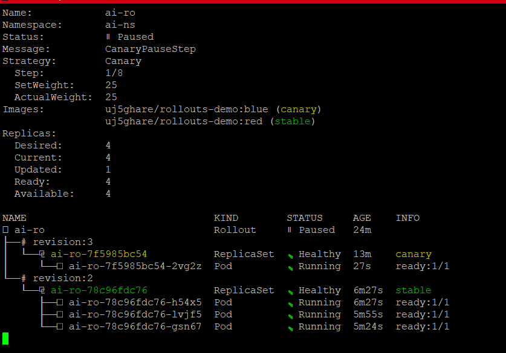


4. We can access ArgoCD UI by using following cmds:
```
kubectl port-forward svc/argocd-server 8080:80 --address 0.0.0.0  -n argocd &
# Go to brower and paste this <your-Ec2-ip>:8080

# To find ArgoCD UI Password (User=admin)
kubectl -n argocd get secret argocd-initial-admin-secret -o jsonpath="{.data.password}" | base64 -d 
```
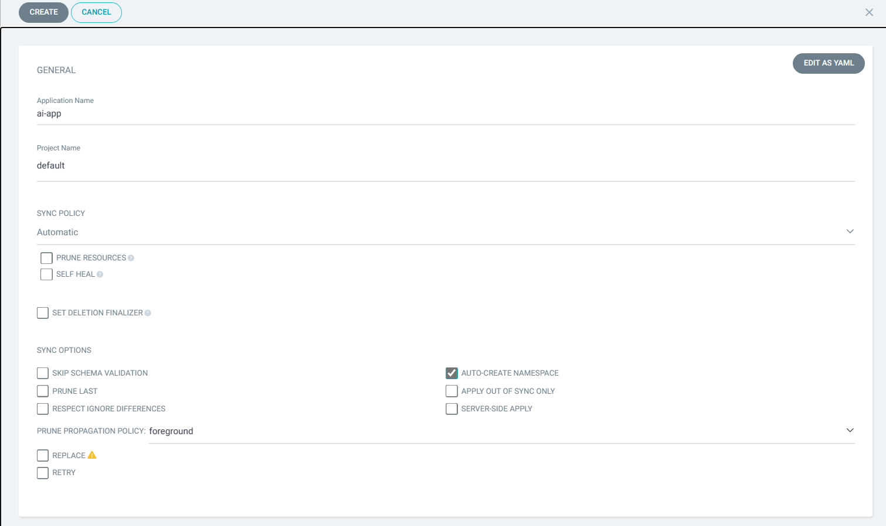
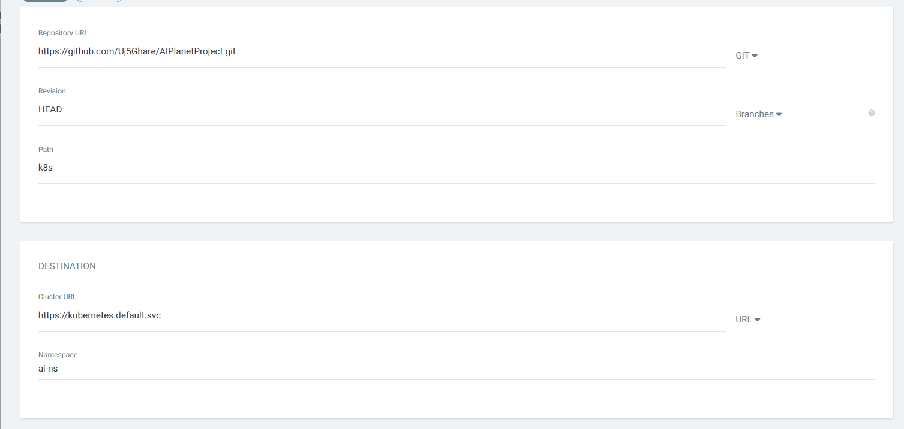
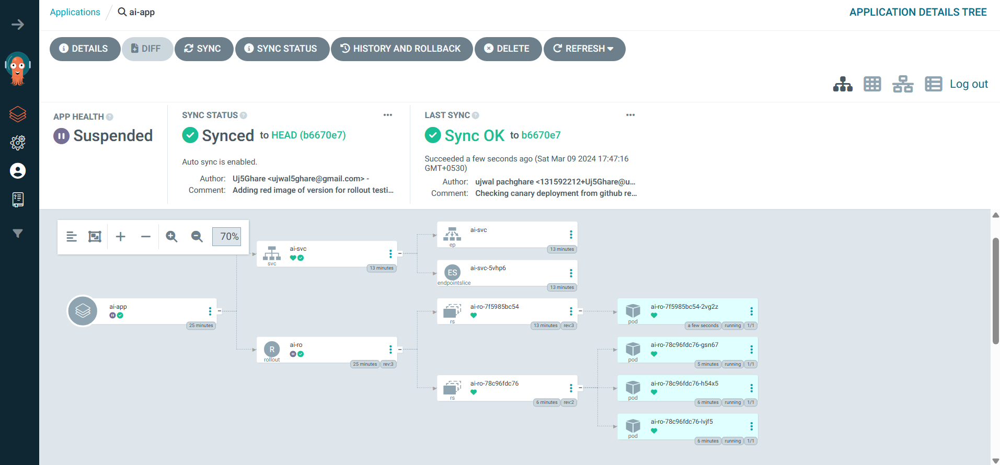
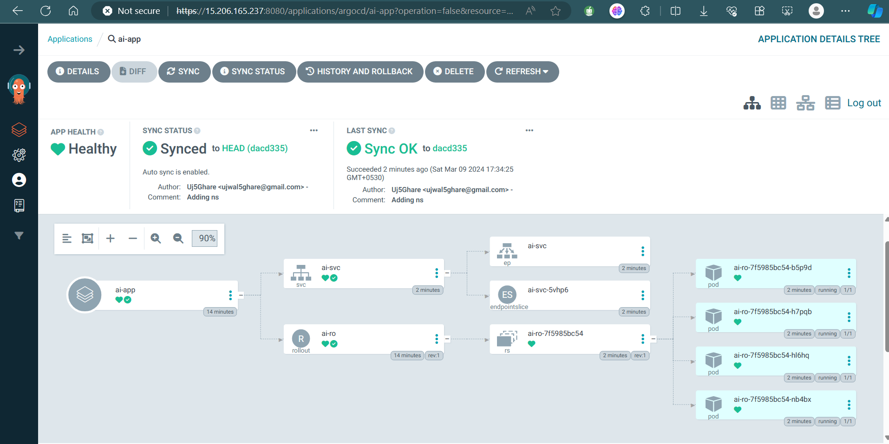

##
### Task 3: Implementing a Canary Release with Argo Rollouts

**Trigger a Rollout:**

1. Update "COLOR" secret to "red"
2. Do changes in any GitHub file and push it to your GitHub repo. 

**Monitor the Rollout:**

1. Now you can watch changes live by hitting this cmd in your terminal.

```
kubectl argo rollouts get ro ai-ro -n ai-ns -w
```

2. Ensure the canary release completes successfully.

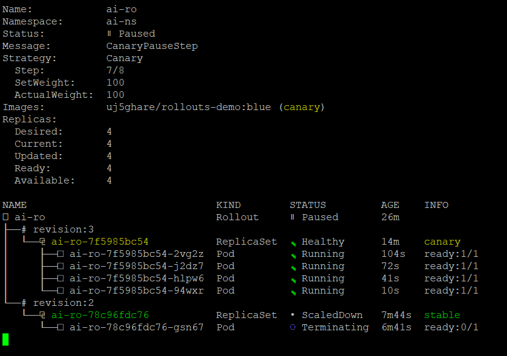
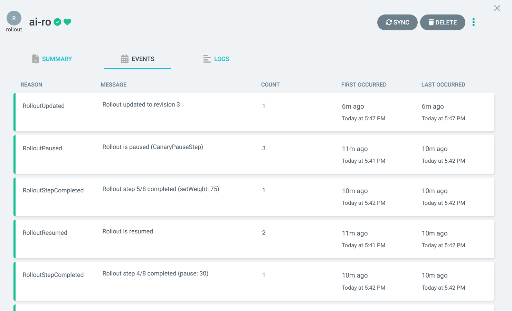
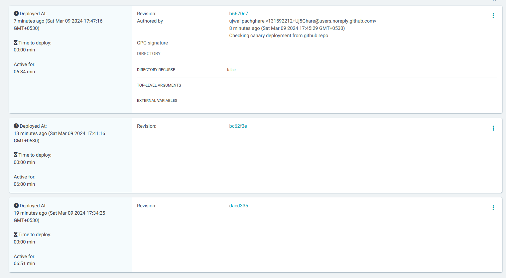


##
### Task 4: Documentation and Cleanup

**Document the Process:**

1. Create a `readme.md` file in your repository to document the steps you took, including any challenges encountered and how they were resolved.
Ex: My Challeges and how I resolved
```
I. To access app from browser which is running inside the minikube we have to forward svc ports by using below cmds

kubectl port-forward svc/my-svc --address 0.0.0.0 8080:80

IMP: kubectl port-forward is used for creating a local connection to a specific Pod, while kubectl expose is used to expose a service to the outside world

```

**Clean Up:**

1. Remove all resources created during this assignment from the Kubernetes cluster using kubectl commands, e.g.:

```
kubectl delete all -l app=ai-app
```
2. Terminate Ec2 Instance/delete minikube 
```
minikube delete
```


##
##


